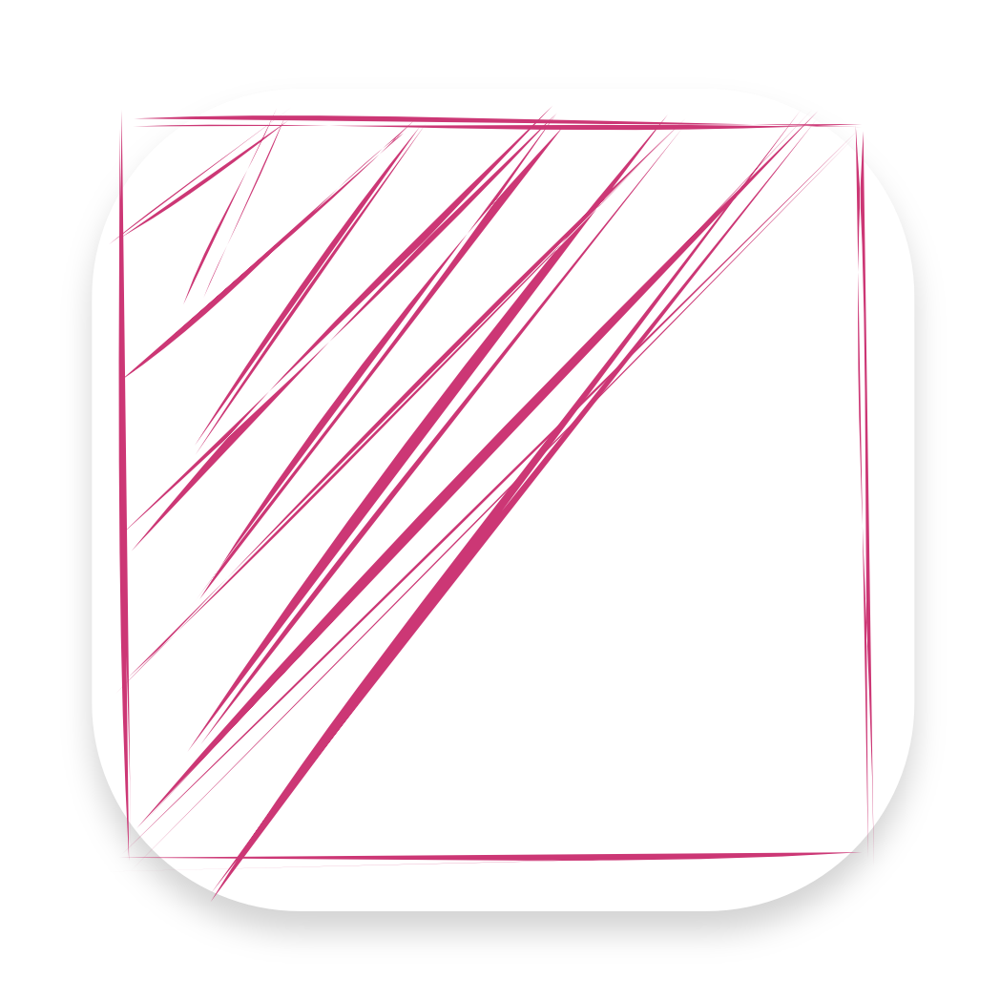
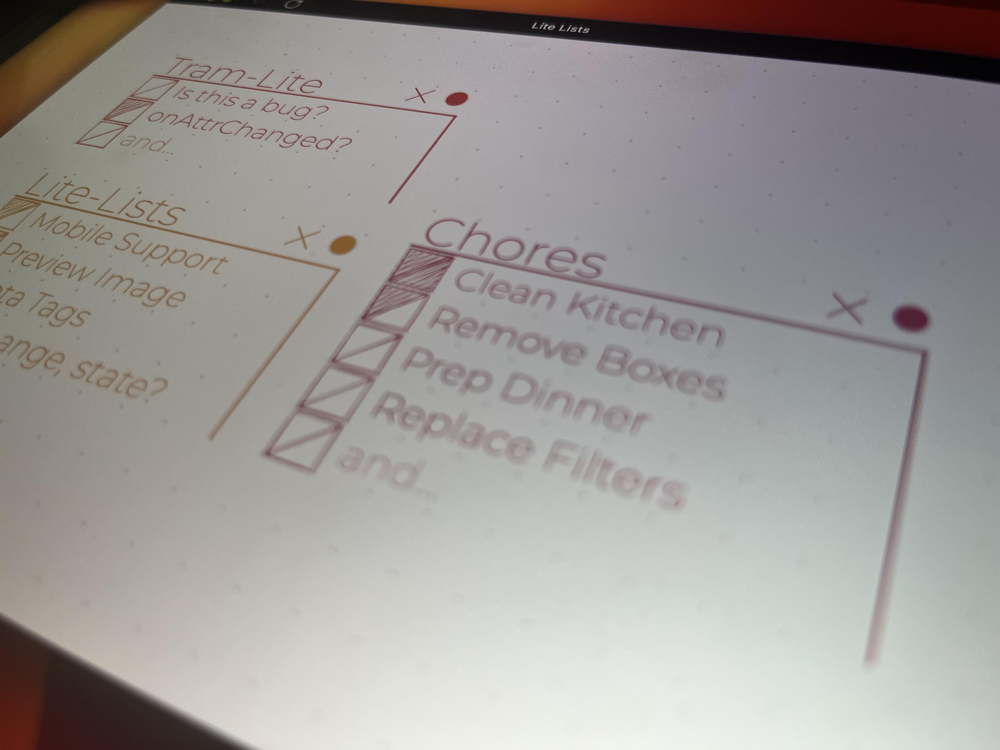

	

# Lite Lists

Lite Lists is a simple todo list web application inspired by some basic dot-journaling patterns.

You can go to the live web-app here: https://jrjurman.com/lite-lists/

	

## Libraries

Lite Lists is mostly an experiment in using [Tram-Lite](https://github.com/Tram-One/tram-lite) - a simple view library for building web-components.

Additional libraries include:

- [Google Fonts](https://fonts.google.com/)
- [Google Icons](https://fonts.google.com/icons)
- [Open-Props](https://open-props.style/)
- [Rough.js](https://roughjs.com/)

## Development

To launch, simply clone the repo, and open the `index.html` in your browser of choice.

If you have npm, you can run `npm start`, which will kick off `serve` and run a simple web host.
